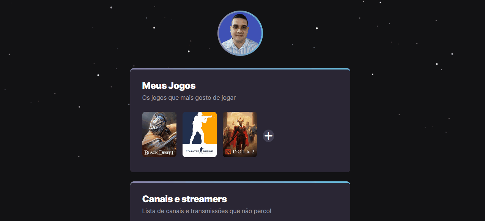

# NLW eSports 

> NLW - Trilha explorer

Este projeto foi construido no evento Next Level Week da Rocketseat.

Foi proposto como desafio pelo instrutor realizar personalizações no projeto, foi disponibilizado um layout alternativo para alterar a imagem de plano de fundo, cores do prjeto e fonte. As altereções que fiz estão descritas mais abaixo.

Para visualizar o projeto em funcionamento:

[Clique aqui](https://kreitmaier.github.io/nlw-esports/)

##  Personalizações realizadas no projeto

- Funções em Javascript para poder adicionar um jogo e um canal.
- Botão para chamar um Modal que permiti adicionar um jogo ou um canal através de um formulário simples.
- Animação nas cores "linear-gradiente" para apresentar um efeito parecido com RGB.
- Alterado o plano de fundo
- Alterado as cores do "liner-gradiente" dos cards.

##  Tecnologias utilizadas

- HTML
- CSS
- Javascript
- Git e Github

